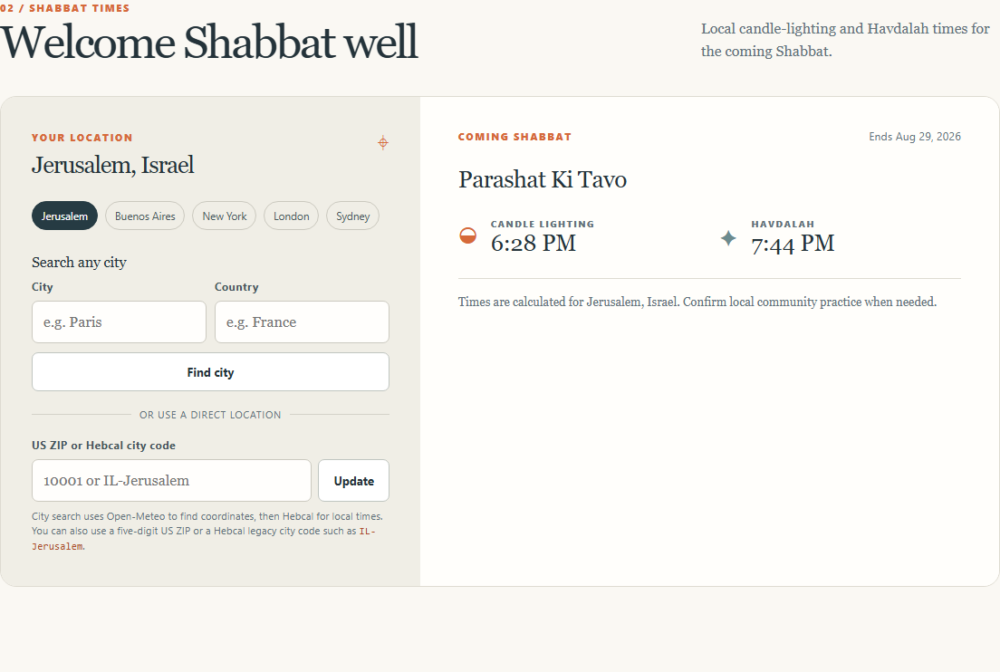
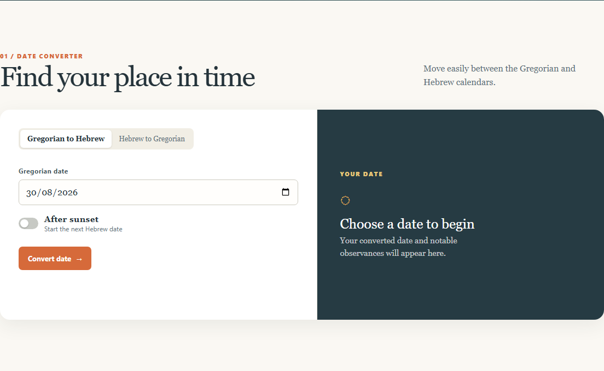
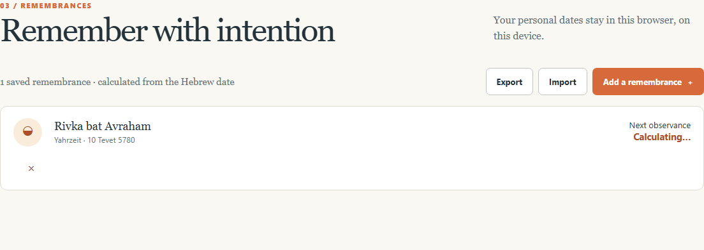

# Or Zarua

**Hebrew Calendar Companion** — a private, local-first planner for Hebrew dates, Shabbat times, and remembrances.

[](https://github.com/privlin-lgtm/HebCal_Companion/actions/workflows/ci.yml)
[Live demo](https://privlin-lgtm.github.io/HebCal_Companion/)


Convert dates, prepare for Shabbat, and keep yahrzeits on your device — no accounts, no server-side memorial data.



## Features

- Convert Gregorian ↔ Hebrew dates (including after sunset)
- Shabbat candle-lighting and Havdalah by city, ZIP, or Hebcal code
- Save remembrances locally; compute the next secular observance date
- Export / import JSON backups
- Offline-friendly: last successful Hebcal responses are reused when the network fails
- Content Security Policy, schema-validated storage, abortable in-flight Shabbat requests

## Quick start

```bash
npm install
npm run dev
```

Open the URL Vite prints (typically `http://localhost:5173/HebCal_Companion/`).

Production build:

```bash
npm run build
npm run preview
```

## Screenshots

| Converter | Remembrances |
|---|---|
|  |  |

## Architecture

Clean Architecture lite under `src/`:

- `domain/` — pure calendar, location, and remembrance rules
- `application/` — use cases over injected ports
- `infrastructure/` — Hebcal, Open-Meteo, localStorage, durable response cache
- `ui/` — DOM controllers
- `createApp.ts` — composition root / DI

See [ARCHITECTURE.md](./ARCHITECTURE.md) for the decision log and remembrance threat model.

## Tests

```bash
npm run typecheck
npm test
npx playwright install chromium
npm run test:e2e
```

## Data sources & privacy

- Calendar / zmanim: [Hebcal](https://www.hebcal.com/)
- City lookup: [Open-Meteo Geocoding](https://open-meteo.com/en/docs/geocoding-api)
- Remembrance **names** stay in your browser
- Original memorial **dates** are sent to Hebcal only to convert and refresh upcoming observance dates

## License

Personal / portfolio project. Calendar data © respective providers.
